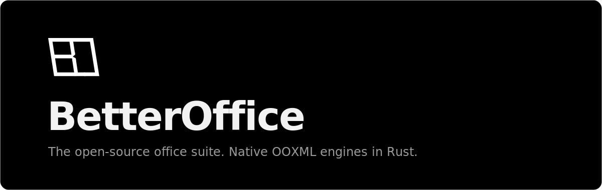

<p align="center">
  <a href="https://betteroffice.dev">
    
  </a>
</p>

<p align="center">
  Rust-native OOXML engines with collaboration and agent editing at the core.<br>
  WebAssembly for browsers. Headless APIs for servers. Native Rust where you need it.
</p>

<p align="center">
  <a href="./LICENSE"></a>
  <a href="https://www.npmjs.com/org/betteroffice"></a>
  <a href="https://crates.io/search?q=betteroffice"></a>
  <a href="https://betteroffice.dev"></a>
  <a href="https://openooxml.org"></a>
</p>

## Packages

| package | what it does |
|---|---|
| [`betteroffice-xlsx`](https://crates.io/crates/betteroffice-xlsx) | typed Rust API for opening, editing, calculating, rendering, and saving XLSX workbooks |
| [`@betteroffice/xlsx`](https://www.npmjs.com/package/@betteroffice/xlsx) | framework-free spreadsheet core powered by the Rust engine through WebAssembly |
| [`@betteroffice/xlsx-react`](https://www.npmjs.com/package/@betteroffice/xlsx-react) | drop-in React spreadsheet editor |

## Structure

- `crates/` — the Rust engines
- `packages/` — the TypeScript editor packages
- `apps/web` — [betteroffice.dev](https://betteroffice.dev) (Next.js on Cloudflare Workers)
- `apps/docs` — documentation

## Development

```bash
bun install
bun run build:xlsx-wasm # compile the ignored spreadsheet wasm asset
bun run dev          # web app
bun run rust:check   # fmt + clippy + tests for the engines
```

## Contributing

Contributions are welcome. We ask for a one-time signature of the [Contributor License Agreement](CLA.md) on your first pull request ([corporate version](CCLA.md)).

## License

[Apache-2.0](LICENSE) — third-party attribution in [THIRD-PARTY-NOTICES.md](THIRD-PARTY-NOTICES.md).
