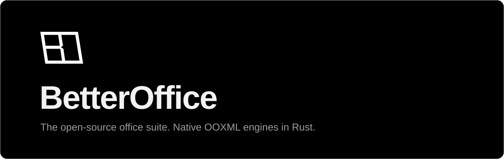

<p align="center">
  <a href="https://betteroffice.dev">
    
  </a>
</p>

<p align="center">
  Rust-native OOXML engines with collaboration and agent editing at the core.<br>
  WebAssembly for browsers. Headless APIs for servers. Native Rust where you need it.
</p>

<p align="center">
  <a href="./LICENSE"></a>
  <a href="https://www.npmjs.com/org/betteroffice"></a>
  <a href="https://crates.io/search?q=betteroffice"></a>
  <a href="https://pypi.org/project/betteroffice-xlsx/"></a>
  <a href="https://betteroffice.dev"></a>
  <a href="https://openooxml.org"></a>
</p>

## Packages

### Documents — `.docx`

| package | registry | what it does |
|---|---|---|
| [`betteroffice-docx`](https://crates.io/crates/betteroffice-docx) | crates.io | typed Rust API for opening, editing, laying out, and saving DOCX documents |
| [`@betteroffice/docx`](https://www.npmjs.com/package/@betteroffice/docx) | npm | framework-free .docx editor core — parsing, CRDT editing, and page layout in Rust through WebAssembly |
| [`@betteroffice/docx-react`](https://www.npmjs.com/package/@betteroffice/docx-react) | npm | drop-in React .docx editor |
| [`betteroffice-docx`](https://pypi.org/project/betteroffice-docx/) | PyPI | Python API for reading, editing, laying out, and rasterizing DOCX documents |

### Spreadsheets — `.xlsx`

| package | registry | what it does |
|---|---|---|
| [`betteroffice-xlsx`](https://crates.io/crates/betteroffice-xlsx) | crates.io | typed Rust API for opening, editing, calculating, rendering, and saving XLSX workbooks |
| [`@betteroffice/xlsx`](https://www.npmjs.com/package/@betteroffice/xlsx) | npm | framework-free spreadsheet core powered by the Rust engine through WebAssembly |
| [`@betteroffice/xlsx-react`](https://www.npmjs.com/package/@betteroffice/xlsx-react) | npm | drop-in React spreadsheet editor |
| [`betteroffice-xlsx`](https://pypi.org/project/betteroffice-xlsx/) | PyPI | Python API for opening, recalculating, styling, rendering, and saving XLSX workbooks |

### Presentations — `.pptx`

| package | registry | what it does |
|---|---|---|
| [`betteroffice-pptx`](https://crates.io/crates/betteroffice-pptx) | crates.io | typed Rust API for opening, editing, rendering, and saving PPTX presentations |
| [`@betteroffice/pptx`](https://www.npmjs.com/package/@betteroffice/pptx) | npm | framework-free .pptx editor core — slide model, masters, and rendering in Rust through WebAssembly |
| [`@betteroffice/pptx-react`](https://www.npmjs.com/package/@betteroffice/pptx-react) | npm | drop-in React .pptx editor |
| [`betteroffice-pptx`](https://pypi.org/project/betteroffice-pptx/) | PyPI | Python API for reading, editing, saving, and laying out PPTX presentations |

What to install for which language, with a first example each:
[npm](https://docs.betteroffice.dev/docs/javascript),
[crates.io](https://docs.betteroffice.dev/docs/rust),
[PyPI](https://docs.betteroffice.dev/docs/python).

## Structure

- `crates/` — the Rust engines
- `packages/` — the TypeScript editor packages
- `bindings/` — the Python bindings
- `apps/web` — [betteroffice.dev](https://betteroffice.dev) (Next.js on Cloudflare Workers)
- `apps/docs` — documentation

## Development

```bash
bun install
bun run build:xlsx-wasm # compile the ignored spreadsheet wasm asset
bun run build:docx-wasm # compile the ignored document wasm assets
bun run dev          # web app
bun run rust:check   # fmt + clippy + tests for the engines
```

<!-- BEGIN GENERATED VISUAL FIDELITY -->
## Visual fidelity

*Generated by the [Visual fidelity action](.github/workflows/visual-fidelity.yml).*

| Format | Latest published version | SSIM | Latest commit | SSIM | Samples (published / commit) |
| --- | --- | ---: | --- | ---: | ---: |
| DOCX | [0.1.0](https://www.npmjs.com/package/@betteroffice/docx/v/0.1.0) | 0.7711 | [d84657d0](https://github.com/openooxml/betteroffice/commit/d84657d0c000158271ed1f65888998d8fea1091e) | 0.7711 | 1 / 1 |
| PPTX | [0.0.4](https://www.npmjs.com/package/@betteroffice/pptx/v/0.0.4) | — | [d84657d0](https://github.com/openooxml/betteroffice/commit/d84657d0c000158271ed1f65888998d8fea1091e) | — | 0 / 0 |
| XLSX | [0.1.0](https://www.npmjs.com/package/@betteroffice/xlsx/v/0.1.0) | — | [d84657d0](https://github.com/openooxml/betteroffice/commit/d84657d0c000158271ed1f65888998d8fea1091e) | — | 0 / 0 |

SSIM is the mean page-penalized grayscale score at 150 DPI, without resizing or alignment correction. Missing or extra pages are penalized. All formats use pinned CDN fonts. XLSX uses recorded print ranges and scale; its score measures range rendering, not automatic print pagination. **— = not measured.** Demo samples do not establish corpus-wide quality or a leaderboard rank.

The commit column pins the tested source revision; generated README-only commits are excluded. Office versions, UTC render times, source files, page PNGs, and hashes are recorded per sample: [betteroffice-demo](https://corpus.betteroffice.dev/betteroffice-demo/metadata.json).
<!-- END GENERATED VISUAL FIDELITY -->

## Contributing

Contributions are welcome. We ask for a one-time signature of the [Contributor License Agreement](CLA.md) on your first pull request ([corporate version](CCLA.md)).

## License

[Apache-2.0](LICENSE) — third-party attribution in [THIRD-PARTY-NOTICES.md](THIRD-PARTY-NOTICES.md).
