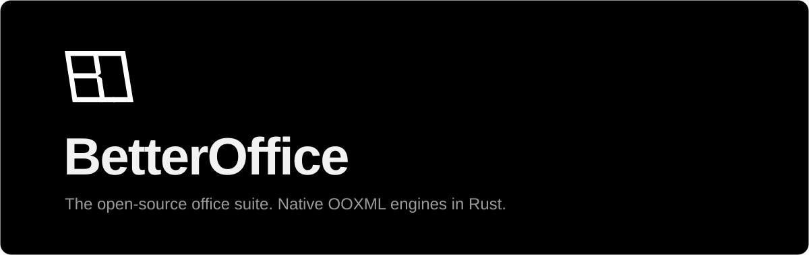

<p align="center">
  <a href="https://betteroffice.dev">
    
  </a>
</p>

<p align="center">
  Rust-native OOXML engines with collaboration and agent editing at the core.<br>
  WebAssembly for browsers. Headless APIs for servers. Native Rust where you need it.
</p>

<p align="center">
  <a href="./LICENSE"></a>
  <a href="https://www.npmjs.com/org/betteroffice"></a>
  <a href="https://crates.io/search?q=betteroffice"></a>
  <a href="https://pypi.org/project/betteroffice-xlsx/"></a>
  <a href="https://betteroffice.dev"></a>
</p>

## Features

- **Documents, spreadsheets, and slides.** Open, edit, render, and save DOCX,
  XLSX and PPTX files with high fidelity. Native OOXML editing preserves untouched
  file parts losslessly when round-tripping.

- **Agent editing with human review.** Review attributed agent edits through
  tracked changes, inline diffs, and before-and-after previews. Accept or
  reject changes directly in the editor.

- **Real-time collaboration.** People and agents edit the same file together,
  with live cursors and selections. Concurrent changes merge automatically,
  and offline edits sync when peers reconnect.

- **Undo and redo.** Navigate editing history and undo accepted agent
  proposals as a single step.

- **Embed or automate.** Drop React editors into your app, build on the
  framework-free JavaScript cores, or use Rust and Python APIs for headless
  processing and agent workflows.

- **Open source and self-hostable.** Apache-2.0 licensed, with control over
  your document storage, deployment, and collaboration infrastructure.

[Try it out](https://demo.betteroffice.dev), or
[explore the docs](https://docs.betteroffice.dev) for setup, APIs, and format support.

## Packages

### Documents — `.docx`

| package | registry | what it does |
|---|---|---|
| [`betteroffice-docx`](https://crates.io/crates/betteroffice-docx) | crates.io | typed Rust API for opening, editing, laying out, and saving DOCX documents |
| [`@betteroffice/docx`](https://www.npmjs.com/package/@betteroffice/docx) | npm | framework-free .docx editor core — parsing, CRDT editing, and page layout in Rust through WebAssembly |
| [`@betteroffice/docx-react`](https://www.npmjs.com/package/@betteroffice/docx-react) | npm | drop-in React .docx editor |
| [`betteroffice-docx`](https://pypi.org/project/betteroffice-docx/) | PyPI | Python API for reading, editing, laying out, and rasterizing DOCX documents |

### Spreadsheets — `.xlsx`

| package | registry | what it does |
|---|---|---|
| [`betteroffice-xlsx`](https://crates.io/crates/betteroffice-xlsx) | crates.io | typed Rust API for opening, editing, calculating, rendering, and saving XLSX workbooks |
| [`@betteroffice/xlsx`](https://www.npmjs.com/package/@betteroffice/xlsx) | npm | framework-free spreadsheet core powered by the Rust engine through WebAssembly |
| [`@betteroffice/xlsx-react`](https://www.npmjs.com/package/@betteroffice/xlsx-react) | npm | drop-in React spreadsheet editor |
| [`betteroffice-xlsx`](https://pypi.org/project/betteroffice-xlsx/) | PyPI | Python API for opening, recalculating, styling, rendering, and saving XLSX workbooks |

### Presentations — `.pptx`

| package | registry | what it does |
|---|---|---|
| [`betteroffice-pptx`](https://crates.io/crates/betteroffice-pptx) | crates.io | typed Rust API for opening, editing, rendering, and saving PPTX presentations |
| [`@betteroffice/pptx`](https://www.npmjs.com/package/@betteroffice/pptx) | npm | framework-free .pptx editor core — slide model, masters, image insertion, shape ordering, and rendering in Rust through WebAssembly |
| [`@betteroffice/pptx-react`](https://www.npmjs.com/package/@betteroffice/pptx-react) | npm | drop-in React .pptx editor |
| [`betteroffice-pptx`](https://pypi.org/project/betteroffice-pptx/) | PyPI | Python API for reading, editing, saving, and laying out PPTX presentations |

### Diagrams (`.vsdx`, source preview)

VSDX packages build from this repository; see the [VSDX guide](https://docs.betteroffice.dev/docs/vsdx).

What to install for which language, with a first example each:
[npm](https://docs.betteroffice.dev/docs/javascript),
[crates.io](https://docs.betteroffice.dev/docs/rust),
[PyPI](https://docs.betteroffice.dev/docs/python).

<!-- BEGIN GENERATED VISUAL FIDELITY -->
## Benchmarks

*Generated by the [Benchmarks action](.github/workflows/visual-fidelity.yml); per-document results are on the [benchmarks site](https://benchmarks.betteroffice.dev).*

### DOCX

Page agreement is reported separately from SSIM.

<table>
<tr><th width="180"></th><th width="230" align="right">BetterOffice (<a href="https://www.npmjs.com/package/@betteroffice/docx/v/0.3.0">0.3.0</a>)</th><th width="230" align="right">BetterOffice (<a href="https://github.com/openooxml/betteroffice/commit/a0204b228b301eb5f284dbabec1ab0a490cc6856">a0204b22</a>)</th><th width="230" align="right">LibreOffice (26.2.3.2)</th></tr>
<tr><td>Exact page counts</td><td align="right">63/63</td><td align="right">63/63</td><td align="right">44/63</td></tr>
<tr><td>Absolute page error</td><td align="right">0</td><td align="right">0</td><td align="right">57</td></tr>
<tr><td>SSIM</td><td align="right">0.8381</td><td align="right">0.8381</td><td align="right">0.7694</td></tr>
<tr><td>Scored/total</td><td align="right">63/63</td><td align="right">63/63</td><td align="right">63/63</td></tr>
<tr><td>Render time (avg)</td><td align="right">485 ms</td><td align="right">484 ms</td><td align="right">758 ms</td></tr>
<tr><td>Parse success</td><td align="right">100.00%</td><td align="right">100.00%</td><td align="right">100.00%</td></tr>
</table>


### PPTX

<table>
<tr><th width="180"></th><th width="230" align="right">BetterOffice (<a href="https://www.npmjs.com/package/@betteroffice/pptx/v/0.2.0">0.2.0</a>)</th><th width="230" align="right">BetterOffice (<a href="https://github.com/openooxml/betteroffice/commit/a0204b228b301eb5f284dbabec1ab0a490cc6856">a0204b22</a>)</th><th width="230" align="right">LibreOffice (26.2.3.2)</th></tr>
<tr><td>SSIM</td><td align="right">0.9169</td><td align="right">0.9169</td><td align="right">0.9030</td></tr>
<tr><td>Scored/total</td><td align="right">103/103</td><td align="right">103/103</td><td align="right">103/103</td></tr>
<tr><td>Render time (avg)</td><td align="right">157 ms</td><td align="right">157 ms</td><td align="right">1324 ms</td></tr>
<tr><td>Parse success</td><td align="right">100.00%</td><td align="right">100.00%</td><td align="right">100.00%</td></tr>
</table>

### XLSX

<table>
<tr><th width="180"></th><th width="230" align="right">BetterOffice (<a href="https://www.npmjs.com/package/@betteroffice/xlsx/v/0.3.0">0.3.0</a>)</th><th width="230" align="right">BetterOffice (<a href="https://github.com/openooxml/betteroffice/commit/a0204b228b301eb5f284dbabec1ab0a490cc6856">a0204b22</a>)</th><th width="230" align="right">LibreOffice (26.2.3.2)</th></tr>
<tr><td>SSIM</td><td align="right">0.7661</td><td align="right">0.7661</td><td align="right">0.6892</td></tr>
<tr><td>Scored/total</td><td align="right">207/208</td><td align="right">207/208</td><td align="right">195/208</td></tr>
<tr><td>Recalc accuracy</td><td align="right">99.60%</td><td align="right">99.60%</td><td align="right">85.87%</td></tr>
<tr><td>Recalc time (avg)</td><td align="right">95 ms</td><td align="right">95 ms</td><td align="right">448 ms</td></tr>
<tr><td>Parse success</td><td align="right">100.00%</td><td align="right">100.00%</td><td align="right">100.00%</td></tr>
</table>

For how scores, timings and coverage are measured, see the [benchmark methodology](scripts/office-quality/README.md).

<!-- END GENERATED VISUAL FIDELITY -->

## Structure

- `crates/` — the Rust engines
- `packages/` — the TypeScript editor packages
- `bindings/` — the Python bindings
- `e2e/` — browser tests, corpus scenarios, and the shared test harness
- `apps/web` — [betteroffice.dev](https://betteroffice.dev) (Next.js on Cloudflare Workers)
- `apps/demo` — editor playground
- `apps/docs` — documentation

## Development

```bash
bun install
bun run dev:demo     # editor playground; builds the wasm bundles on first run
bun run dev          # betteroffice.dev site (no wasm needed)
bun run dev:docs     # documentation site
bun run rust:check   # fmt + clippy + tests for the engines
```

Run `bun run test:e2e:browser` for headless browser tests of all three editors.
The [E2E guide](e2e/README.md) also covers pinned corpus scenarios,
cross-SDK checks, and operation profiles. The XLSX and PPTX JavaScript cores expose
opt-in operation timings; the native XLSX facade also reports edit stage timings.

Use the [Office visual quality harness](scripts/office-quality/README.md) to export Word, PowerPoint, and Excel references, compare local renders, or refresh the fidelity scores with the manual action.


## Contributing

Contributions are welcome. We ask for a one-time signature of the [Contributor License Agreement](CLA.md) on your first pull request ([corporate version](CCLA.md)).

## License

[Apache-2.0](LICENSE) — third-party attribution in [THIRD-PARTY-NOTICES.md](THIRD-PARTY-NOTICES.md).
